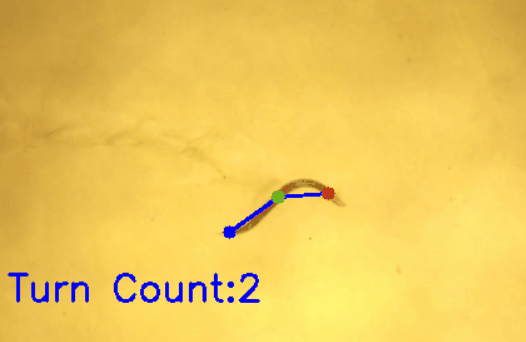

# Worms turn detector

Detect C. elegans worm turn count in videos.



# Usage

worm-turn is a command line application that processes all the video files in the working directory, in each video detecting C .elegans worm and calculating the number of turns it makes throughout the video.

Just make sure that worm_turn and the input video files are in the same directory and run the application.

The output goes to a single results.txt file holding detected worm turns for each video.

e.g.

1. place videos `1.mp4, 2.mp4, 3.mp4, 4.mp4` and `worm-turn.exe` in same directory.
2. execute `worm-turn.exe`
3. observer results in generate file <TIMESTAMP>-results.txt

```python
Video: '1.mp4', Turns: 114
Video: '2.mp4', Turns: 103
Video: '3.mp4', Turns: 108
Video: '4.mp4', Turns: 91
````

## Additional options
* `--show_frames` - visualize video frames, detected worm and its structure
* `--debug_vis` - debug visualization of intermediate buffers
* `--dump_stats` - create a .prof_stats file with execution performance dump

# Precision

The algorithm results were compared with a number of test videos, that are available from 
<https://drive.google.com/drive/folders/1VBQpeBdRyQ_5JMljwuouo8IFMSjoALbc>

| Video name  | Ground truth | worm_turn |
| ----------- | ----------- | -----------
| mut_control_1.mp4 | 114| 114 |
| mut_control_2.mp4 | 101 | 103 |
| mut_control_3.mp4 | 108 | 108 |
| mut_control_4.2.mp4 | 92 | 91 |

# Limitations

* Only one worm per video
* Constant zoom during the video
* Pure vertical oscillations are ignored
* Worm spinning into circle case ignored

# Developing - Build and Run

## Windows

1. `pip install -r requirements.txt`
2. `build_cython.cmd`
3. `python main.py`

Additional to the above you can create a standalone executable via following command:

`build_app.cmd`

# Thanks

* Ekaterina Ilicheva, <ilichevaey@gmail.com>, phd, senior researcher, IEM (https://en.iemspb.ru/) - for raising the problem
* Federico Fellini - for raising the problem and providing test videos
* Aleksandra Mekhova, <alex.mekhova@gmail.com>, - for assisting in application developement, testing, making ground truth turn calculations and providing example assets